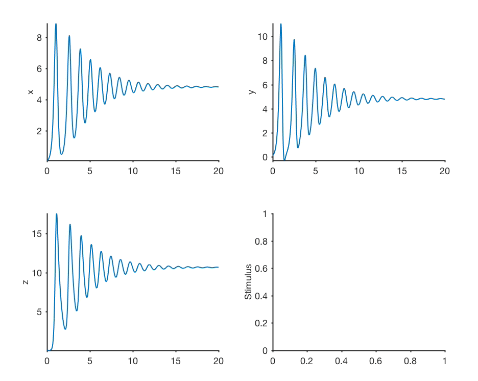
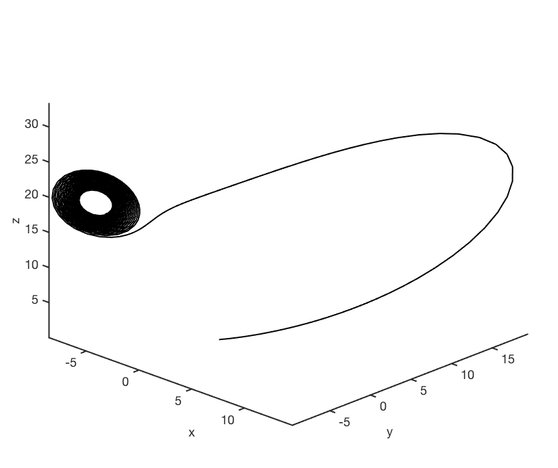

# model

Elegant Mathematica-style model manipulation and fitting in MATLAB 

## What this is

`model` is a MATLAB [abstract class](https://www.mathworks.com/help/matlab/matlab_oop/abstract-classes-and-interfaces.html) that makes it easy for your to build your own models. Here, I mean "model" to mean any system that operates on a time series of input (or not) and generates a time series of N outputs. 

Once you write your model to inherit from `model`, you can do all sorts of crazy stuff with it like:

1. viewing time series outputs of your model, that you can see update in real time as you vary parameters (like Mathematica's [manipulate](https://reference.wolfram.com/language/ref/Manipulate.html))
2. You can actually view any arbitrary function acting on your model while you manipulate its parameters. `model` ships with two built in functions (time series and mapping outputs vs. inputs), but you can write whatever function you want, and `model` does all the heavy lifting for you in the background to wire up outputs and UX elements. 
3. fit your model to data using all the fitting routines MATLAB has to offer. It's as simple as typing `model.fit()`. [WIP, see [roadmap](#roadmap) ]

## Example usage

#### View time series plots of any model, while manipulating parameters



Here, the `lorenz` model is being manipulated, and the built-in time series view used to look at the time series of the Lorenz model. I'm changing one parameter and seeing how the Lorenz system switches between chaotic and non-chaotic states. 

In this built in view, the last panel showing the stimulus is empty because we didn't define any stimulus for the Lorenz Model (it doesn't need any). 

#### Define your own visualizations and manipulate those



Here, the `lorenz` model is being manipualted, while viewing a function defined within the `lorenzModel` class. You can define arbitrary functions that plot whatever you want - and `model` intelligently wraps your code and provides handles to manipulate parameters. 

## How to use this

Write a class that defines your model, inheriting from this abstract class, following this skeleton:

```matlab
classdef yourModel < model
	properties
		% define parameters and bounds
		parameter_names = {'sigma','alpha'};
		lb = [0 0]; % lower bounds
		ub = [100 100];
		default_values = [1 3];
		variable_names = {'x','y','z'};  % you can have as many as you want, and name them anything
	end 

	methods
		function [m] = evaluate(m) % here, we use m to refer to the object (like obj in Python)
			% define your model here
		end 

		function m = plotCustom(m,action)
			% (optional) define your custom plotting function here
		end
 	end 

 	methods (Static)
 		function [...] = myStaticMethod(...)
 			% define your static methods here (optional)
 		end
 	end
end 
```

You can look at the included example models (like `lorenzModel.m`) for an example. 


## Roadmap

* Model manipulation ✔️
* Support for user-defined plot functions ✔️
* Fitting models to data 🚧 Still being built. In the meantime, use this [older toolbox](https://github.com/sg-s/fitmodel2data) 


## License 

`model` is [free software](https://www.gnu.org/licenses/gpl-3.0.en.html).

 